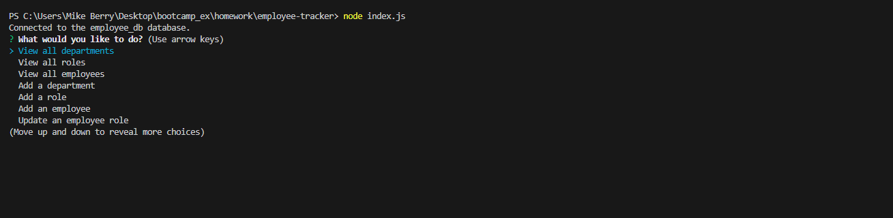

# employee-tracker

## Description

This project aimed to create a command line application for management of an employee database. When the application is run from the command line via the command node index.js, the user is presented with a menu of employee management options. Users can view active departments, roles and thier associated departments, and detailed employee information. Users can also add new departments, roles, and employees to the database by answering a series of prompts. Users also have the option to update the roles of individual employees and have this reflected in the database.

This project continued to highlight the use of node.js to write start writing backend code using JS as the entire application is run via the command line. The inquirer package was again used to create the menu and question prompts and give structure to interacting with the database. The mysql2 package was used to connect to the database and make the queries which were responsible for showing information from and adding to the database.

## Usage

As this project was not deployed, the repo of the project can be found at https://github.com/mgberrysd/employee-tracker

When run on the command line the user should see the following:

A video of the application being run can be found at https://drive.google.com/file/d/1LYwvMlCMcFSILtZnZ53ayMSuI2jfF602/view

## Credits

The JS for the Employee Tracker was created by Michael Berry.

The project used the node Inquirer package for the command line prompts and the node mysql2 package for connecting to a sql database.